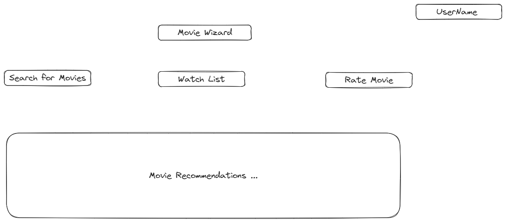
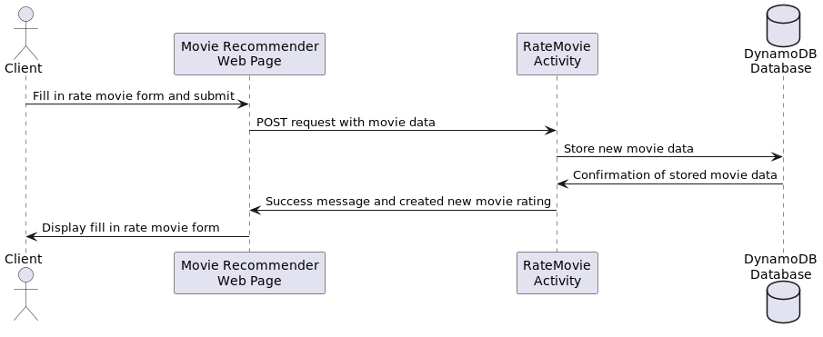
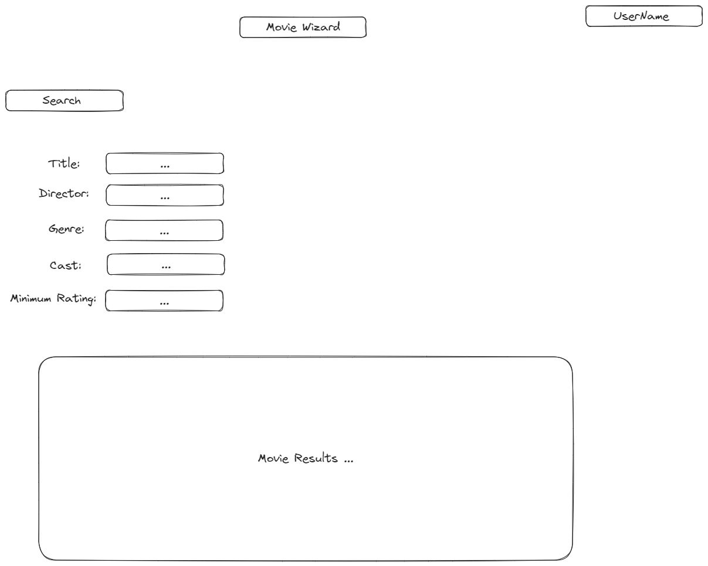
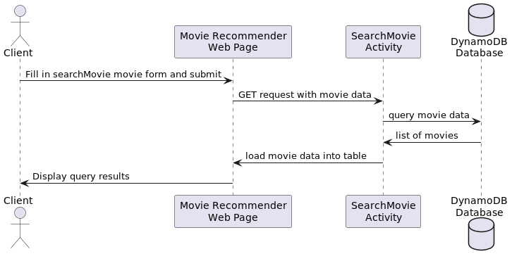
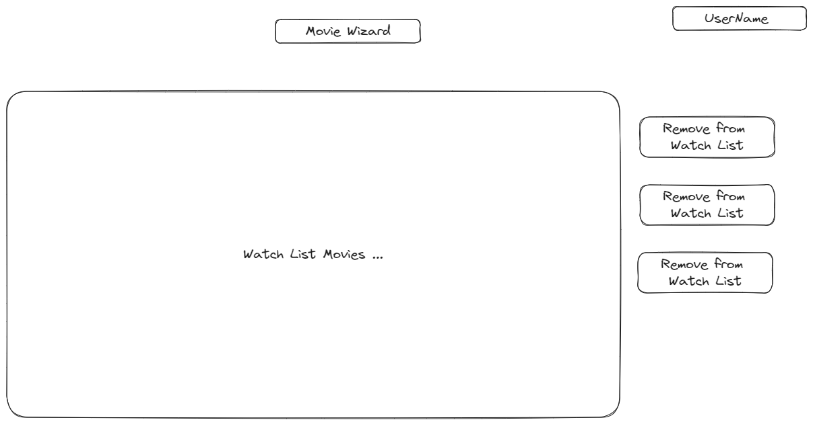

# Design Document: Movie Recommendation Web App

## Problem Statement
The Movie Recommendation Web App aims to provide personalized movie recommendations to users based on their preferences 
and previous movie-watching history. The goal is to allow users to discover new movies they might enjoy and enhance their overall movie-watching experience.

## Top Questions to Resolve in Review
- What algorithms and data models should be used to generate accurate movie recommendations based on user preferences and history?
- How can I efficiently store and retrieve movie data, user ratings, and watch history?
- What features can be implemented to enhance the user experience and engagement with the movie recommendation web app?

## Use Cases
- U1. As a user, I want to create an account and provide my movie preferences.
- U2. As a user, I want to rate movies that I have watched.
- U3. As a user, I want to view personalized movie recommendations based on my preferences and ratings.
- U4. As a user, I want to search for specific movies by title, genre, or other attributes.
- U5. As a user, I want to add movies to my watchlist for future reference.
- U6. As a user, I want to view detailed information about movies, including trailers, cast, and reviews.

## Project Scope
### In Scope
- Movie rating system
- Movie recommendation engine
- Movie search functionality
- Watchlist management
- Movie details and information retrieval

### Out of Scope
- Streaming movies within the web app
- User social features, such as sharing movie recommendations with friends
- machine learning/ more complex recommendation algorithms 

## Proposed Architecture Overview
The Movie Recommendation Web App will be developed using Java for the server-side logic, DynamoDB for data storage, and 
HTML, CSS, and JavaScript for the front-end. The application will use AWS API Gateway and AWS Lambda for handling API requests.

- Front-end:  HTML, CSS, and JavaScript
- Back-end: Java- movie ratings, recommendation generation, and data retrieval.
- Database: DynamoDB to store movie data, user ratings, and user information.
- APIs: Use AWS API Gateway to define and manage the APIs that interact with the front-end and back-end.

## API

### Public Models

```
// MovieModel
String id;
String title;
String genre;
String director;
int releaseYear;
double rating;
List<String> cast;
String trailerUrl;
```
## User Create

- **POST /api/register:** Register a new user account with the provided details
- 
## Movie Rating Endpoints

- **POST /api/movies/{id}/rate:** Rate a movie with a given ID, accepting the user's rating as a parameter. (how do i want to weight the user rating?)

## Movie Recommendation Endpoints

- **GET /api/recommendations:** Retrieve personalized movie recommendations for user based on their preferences and ratings. (is there a way to have a more personalize recommendation if a users reviews don't line up with the average reviews)

## Movie Search Endpoint

- **GET /api/movies:** Search for movies based on parameters like title, genre, director, or release year.

## Watchlist Management Endpoints

- **GET /api/watchlist:** Retrieve the movies in the user's watchlist.
- **POST /api/watchlist:** Add a movie to the user's watchlist.
- **DELETE /api/watchlist/{id}:** Remove a movie from the user's watchlist.

## Movie Details Endpoint

- **GET /api/movies/{id}:** Retrieve detailed information about a specific movie, including trailers, cast, and reviews.

## 7. Tables

### 7.1. `movies`

```
id // partition key, string
title // string (GSI)
genre // string
director // string
releaseYear // number
rating // number
cast // list
trailerUrl // string

```

### 7.2. `users`

```
id // partition key, string
username // string
password // string
email // string
preferences // map (probably key value pair (movie ids, rating))
watchlist // movies list
organizedRatings // map (movie ids, rating)

```
### 7.2. `genre`

```
id // partition key, string
genreVarients // string

```
## 8. Pages










